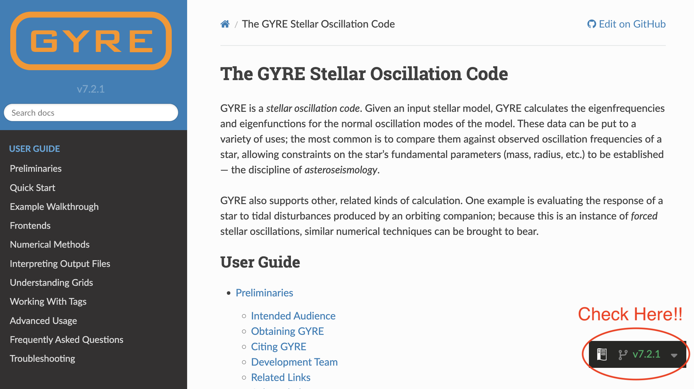
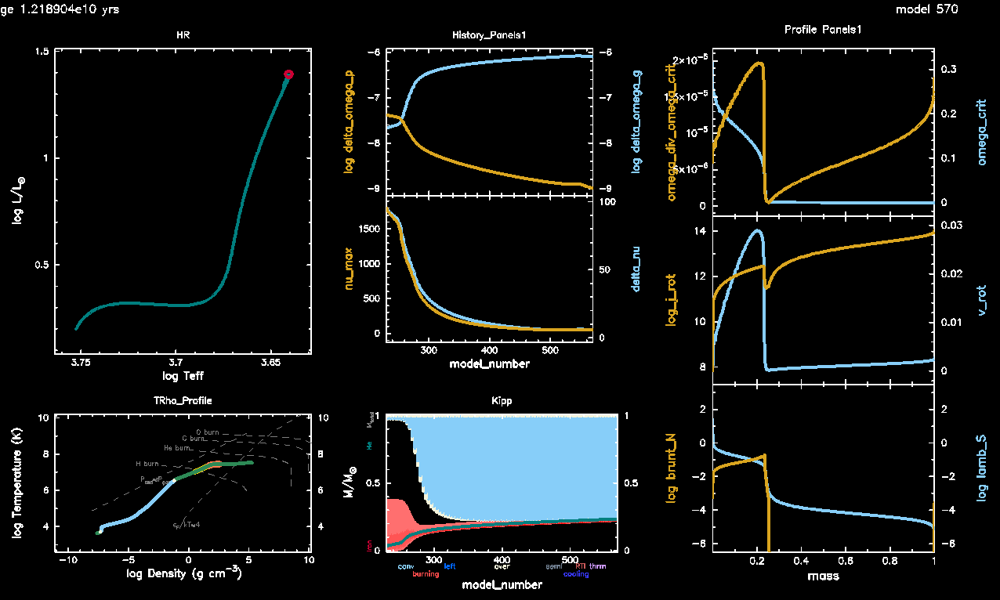
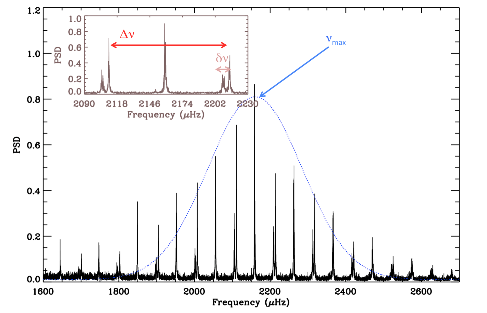
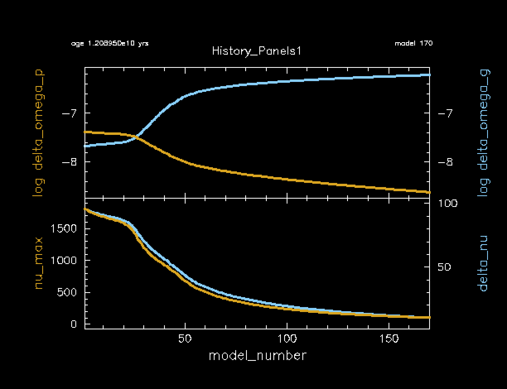
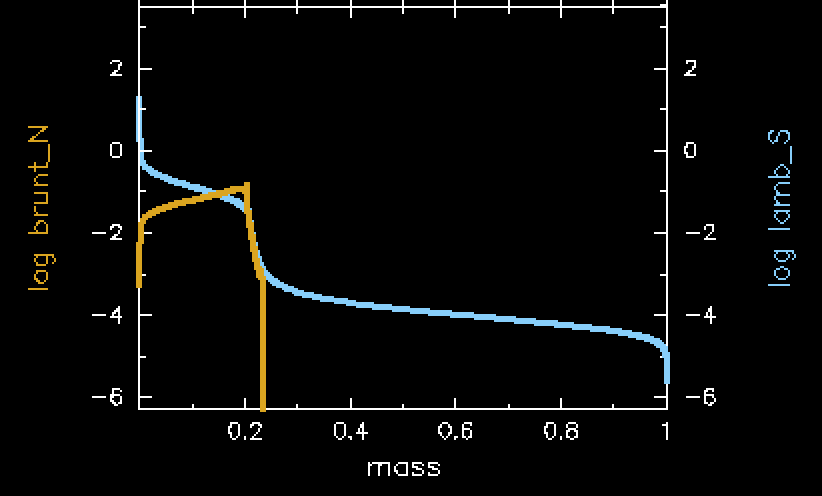

# Lab 1: Installing and using GYRE

`MESA` is distributed with two codes for stellar oscillations:

- [`GYRE`](https://gyre.readthedocs.io/en/stable/), by R. H. D. Townsend, and
- [`ADIPLS`](https://ui.adsabs.harvard.edu/abs/2008Ap%26SS.316..113C/abstract), by J. Christensen-Dalsgaard.

The calculations performed by the two are essentially equivalent, with the main tradeoff being between performance and ease of use. In this tutorial, we will restrict our attention to `GYRE`, which is much easier to get started with.


## Installing GYRE

GYRE comes automatically packed in with your MESA installation. For MESA version 24.08.1, the shipped GYRE version is 7.2.1. However, GYRE has since updated to version 8.0. Be sure that you are viewing the docs for the correct version number of the GYRE version that you are using. For GYRE 7.2.1, the link to the documentation is [here](https://gyre.readthedocs.io/en/v7.2.1/index.html).

See the screenshot below to check for the correct GYRE version when viewing the docs. If you see "latest" or "stable" here, that indicates you are viewing version 8.0 (for now, until a new update comes out).


The [GYRE Docs](https://gyre.readthedocs.io/en/v7.2.1/ref-guide/installation.html) contains a tutorial for GYRE installation. However, since we are not installing GYRE from a tar file, we will slightly modify what is written in this guide. The instructions are copied below with explicit changes listed.

### Extracting GYRE
We will not need to extract the GYRE source code from a tar file, as it is already extracted. 

### Set Environment Variables
Secondly, we will set the environment variable `$GYRE_DIR` equal to the following:

``export GYRE_DIR=$MESA_DIR/gyre/gyre``

Remember that this is best placed inside your shell's RC file in your home directory (usually `.bashrc` or equivalent), similarly to when you first installed MESA. **Don't forget to `source` this file to apply the changes to your terminal window!**

### Compile
Now, we can follow the GYRE installation guide from this point. Go ahead and compile:

``$ make -j -C $GYRE_DIR install``

### Test
Once that's complete, it's good practice to run the test suite to ensure nothing has gone wrong during the installation process:

``$ make -C $GYRE_DIR test``

|:information_source: INFO |
|:--|
| If all the tests read "...succeeded" then you are good to move on to the next step. If that's not the case, ask your TA or a developer for help. |

## Create a rotating red giant star model

In today's labs, we will be studying the oscillation frequencies of red giant stars and how those oscillations are affected by rotation. So, to start, we will need to generate a model of a red giant star that is rotating. 

### 1: Download our template from Github

First, create a new working directory for your rotating star model. Call it whatever you like, for this walkthrough we will call it `friday_labdir`. Then copy in the files from the standard work directory in the `MESA` defaults.

```sh
mkdir friday_labdir
cd friday_labdir
cp -r $MESA_DIR/star/work/* .
```

Now, copy the files from [the friday labs github page](https://github.com/darthoctopus/mesa-asteroseismology-2025/blob/master/Resources/Models/lab1_template.zip). **CHECK THIS LINK BEFORE FINAL SUBMIT** Place these files into your working directory. Your directory should have the following files in it

```
>> tree .
.
├── ck
├── clean
├── history_columns.list
├── inlist
├── inlist_1M_star
├── inlist_pgstar
├── make
│   └── makefile
├── mk
├── profile_columns.list
├── re
├── rn
├── src
│   ├── run_star_extras.f90
│   └── run.f90
└── tams.mod

3 directories, 14 files
```

### 2: Update the template files

The files you've downloaded will be a template version of the files you need to run this lab. First we will need to add a few lines to the inlist that runs the star (`inlist_1M_star`). 

#### star_job

Notice that we are starting from a 1Msun TAMS model called `tams.mod`. That TAMS model is non-rotating, but this isn't an issue for our rotating model. We initialize the rotation here to save time in the simulation. In your science, you should initialize rotation in a place that makes sense for the problem you are working on. For our purposes, this will be fine as we only care about rotation on the RGB phase.

In `&star_job` is where we will initialize rotation. There are many options in MESA for initializing rotation ([see docs here for an example](https://docs.mesastar.org/en/latest/reference/star_job.html#new-rotation-flag)). We will initialize the rotation as a solid body by setting an initial $\Omega/\Omega_{crit}$ which will be constant across the star.

For today's set of labs, you will be assigned a rotation rate based on your table number. These are all available in [our google sheet](https://docs.google.com/spreadsheets/d/1pAcvlfqOga0JNZo3cjJeZaErVd4youLYHyAmAu3NmSE/edit?usp=sharing) for this lab. You will upload information from these labs to this sheet throughout the day. At each table, there will be four different `nu_max` values to choose from. We will use this value of `nu_max` as a proxy for the age of your rotating RGB star. For now, decide in your group who will choose each value of `nu_max` and claim your model directly in the google sheet.

|:clipboard: TASK |
|:--|
| 1. Pick a rotation rate and nu_max value from [the google sheet](https://docs.google.com/spreadsheets/d/1pAcvlfqOga0JNZo3cjJeZaErVd4youLYHyAmAu3NmSE/edit?usp=sharing) |
| 2. Add the following lines to the `star_job` portion of `inlist_1M_star` |

```fortran
    new_rotation_flag = .true.
    change_rotation_flag = .true.
    change_initial_rotation_flag = .true.
    new_omega_div_omega_crit = ### ! INSERT YOUR ROTATION RATE HERE
    set_initial_omega_div_omega_crit = .true.
    set_omega_div_omega_crit = .true.
```

#### controls

The only thing we'll need to update in `&controls` is to ensure that MESA outputs the type of files needed for GYRE. These are usually referred to as `pulse_data` in the MESA docs.

|:clipboard: TASK |
|:--|
| 1. Add the following lines to the `&controls` portion of `inlist_1M_star` |

```fortran
   write_pulse_data_with_profile = .true.
   add_atmosphere_to_pulse_data = .true.
   keep_surface_point_for_pulse_data = .true.
   add_double_points_to_pulse_data = .true. 
   pulse_data_format = 'GYRE'
```

While you don't need to change these, you should notice that we are running this model at low resolution (`mesh_delta_coeff` and `time_delta_coeff`). Once again, you should choose this value to reflect your science question and convergence studies. We have chosen this value to prioritize running speed.

#### run_star_extras.f90

Since our star is rotating, we can calculate analytically the effect of rotation on the different types of oscillation modes (p-modes and g-modes) in the red giant star. These will be discussed further in Lab 3, but for now we should implement the calculation of them.

In the JWKB approximation, we have the following estimators for g-modes and p-modes, respectively:

$$\Omega_g = \int_{N^2>0} \Omega(r){N \over r}\mathrm d r$$

$$\Omega_p = \int_0^R \Omega(r){\mathrm d r \over c_s}$$

Where $\Omega(r)$ indicates the rotation rate (`s% omega`), $N$ indicates the Brunt-Vaisala frequency (`s% brunt_N2`) and $c_s$ indicates the sound speed (`s% csound`)

We can easily add these estimators to the MESA output as a history file.

|:clipboard: TASK |
|:--|
| 1. Edit your `src/run_star_extras.f90` file to add the above JWKB estimators for $\Omega_g$ and $\Omega_p$ as history columns. |

|:information_source: HINT |
|:--|
| In the template version of `src/run_star_extras.f90`, we have included a fortran function that will help you. This function is called `integrate_r_`. It will help you to integrate a value over the radius of the star. |

|:information_source: SOLUTION BELOW |
|:--|

First, remember to edit the function `how_many_extra_history_columns` to tell it we are going to add two new columns.

```fortran
      integer function how_many_extra_history_columns(id)
        integer, intent(in) :: id
        integer :: ierr
        type (star_info), pointer :: s
	    ierr = 0
        call star_ptr(id, s, ierr)
        if (ierr /= 0) return
        how_many_extra_history_columns = 2 !! change this line
      end function how_many_extra_history_columns
```

Then, we can directly code the equations within `data_for_extra_history_columns`:

```fortran
      subroutine data_for_extra_history_columns(id, n, names, vals, ierr)
        integer, intent(in) :: id, n
        character (len=maxlen_history_column_name) :: names(n)
        real(dp) :: vals(n)
        integer, intent(out) :: ierr
        type (star_info), pointer :: s

        integer :: nz
        logical, allocatable :: mask(:)

	    ierr = 0
        call star_ptr(id, s, ierr)
	    if (ierr /= 0) return

        nz = s% nz

        names(1) = 'delta_omega_p'
        vals(1) = integrate_r_(s% r(1:nz), s% omega(1:nz)/(s% csound(1:nz))) / integrate_r_(s% r(1:nz), 1/(s% csound(1:nz)))
        
        allocate(mask(nz))

        mask = (s% brunt_N2(1:nz) > 1d-10) .and. (s% x(1:nz) < .95)

        names(2) = 'delta_omega_g'
        vals(2) = 0.5 * integrate_r_(s% r(1:nz), s% omega(1:nz) * sqrt(s% brunt_N2(1:nz))/(s% r(1:nz)), mask=mask) &
             / integrate_r_(s% r(1:nz), sqrt(s% brunt_N2(1:nz))/(s% r(1:nz)), mask=mask)

        deallocate(mask)

      end subroutine data_for_extra_history_columns
```

## Run the star

Now go ahead and `./clean`, `./mk`, and `./rn` your model. While it's running, you will see pgstar output, which will be explained below. Your run should take roughly 5 minutes to finish.

### What plots you are seeing

By this point, you should be familiar with the HR diagram (top left), T-Rho Profile (bottom left), and Kippenhahn diagrams (bottom middle). The other panels will show you some important history and profile values within your model.

In the top middle panel you'll see the JWKB estimators (on logarithmic scale) that you included into your history columns above.

In the centermost panel, you'll see the asteroseismic values $\nu_{\rm max}$ (`nu_max`) and $\Delta\nu$ (`delta_nu`). These values are explained below.

In the top 2 panels on the right hand side, you'll see values pertaining to the rotational profile of the star, including the rotation rate $\Omega/\Omega_{crit}$ (`omega_div_omega_crit`), the critical rotation rate $\Omega_{crit}$ (`omega_crit`), the angular momentum (`log_j_rot`), and the linear rotational velocity (`v_rot`). 

In the bottom right you'll see the Brunt-Vaisala frequency (`brunt_N`) and the Lamb frequency (`lamb_S`). These are used to visualize a mode propagation diagram, which will be somewhat explained below, but you will also calculate your own in Lab 2.

### At the end

Near the end of the red giant evolution, your pgstar output should look something like this. Notice the difference between the core and envelope rotation rates, as well as the sharp difference in the angular momentum at the core boundary. 



#### Numax and Delta nu

In solar-like oscillators, such as the red giant we are modelling here, the oscillations excited in the star form a specific pattern, as shown below (reproduced from [Garcia 2015](https://ui.adsabs.harvard.edu/abs/2015EAS....73..193G/abstract)).



This figure also labels two important global asteroseismic parameters. First is $\nu_{\rm max}$ which is roughly the central frequency of the excited oscillations, as denoted in the above figure as the mean of the blue dotted Gaussian curve. The second is $\Delta\nu$ or the large frequency separation, which is the frequency difference between successive radial modes (with increasing radial order $n$). This is denoted by the red solid arrow. This should not be confused with the small frequency separation $\delta\nu$ denoted by a small pink arrow.

These two parameters are incredibly fundamental to solar-like asteroseismology, and can be calculated by MESA. These two parameters (`nu_max` and `delta_nu`) are plotted in the History Panels output of your rotating red giant model, as shown below. Notice how they are highly correlated to each other. In other words, they both decrease at roughly the same rate. Also notice that they both decrease as the star's radius expands. Remember that bigger objects oscillate at lower frequencies, just like in instruments (tubas are much lower frequency than flutes, for example).

You will become more acquainted with $\nu_{\rm max}$ and $\Delta\nu$ as you move through the labs, so don't get discouraged if you aren't understanding the full picture of red giant oscillations just yet!



#### The Mode Propagation Diagram

Stellar oscillations propagate in regions that are unstable to the stellar wave equations, which are approximated by a simple harmonic oscillator. These regions of the star are bounded by two characteristic frequencies: the Brunt-Vaisala frequency (N) and the Lamb frequency (S). These two frequencies are both functions of radius `r` in your stellar model.

Oscillations with frequencies smaller than both `N` and `S` in your stellar model are called g-modes and they can propagate in the g-mode cavity. Alternatively, oscillations with frequencies larger than both `N` and `S` in your stellar model are called p-modes and they propagate in the p-mode cavity. 

In the pgstar output, you will see a line that corresponds to `brunt_N`. This indicates the Brunt-Vaisala frequency, as a function of mass coordinate within your star. Similarly, you will see a line indicating the Lamb frequency `lamb_S`. Specifically, this is the Lamb frequency for ell=1, where ell is the spherical degree in the spherical harmonics equations.

You will generate another representation of this mode propagation diagram in Lab 2, which will give you another opportunity to understand where the mode cavities in this star exist and how they can couple to each other.



## After the run is finished - Final Task

After your run is completed, open up your history file and find the model closest to the `nu_max` value that you chose from [the google sheet](https://docs.google.com/spreadsheets/d/1pAcvlfqOga0JNZo3cjJeZaErVd4youLYHyAmAu3NmSE/edit?usp=sharing). Fill out the first three columns for your model (surface rotation rate, delta_nu, and delta_omega_g) at the value of `nu_max` that you chose. Remember we're using `nu_max` here as a proxy for the age of the RGB, as `nu_max` will decrease as the RGB star expands over time.

|:clipboard: TASK |
|:--|
| Fill out the first three columns of [the google sheet](https://docs.google.com/spreadsheets/d/1pAcvlfqOga0JNZo3cjJeZaErVd4youLYHyAmAu3NmSE/edit?usp=sharing) for your chosen model. |

|:question: QUESTION |
|:--|
| As everyone finishes running their models and inputting their values, what do you notice about the values you've input into the google sheet? Compare both to the different `nu_max` values but also to the different initial rotation rates. |

## Optional Bonus: Output GYRE files at a specific numax

For Lab 2, you will be asked to calculate rotation frequencies at specific $\nu_{\rm max}$ (`nu_max`) values. To make this easier, you may choose to do a bonus exercise where you configure the `run_star_extras.f90` file to output both profile and GYRE files when the model is at a specific $\nu_{\rm max}$.

|:clipboard: OPTIONAL BONUS TASK |
|:--|
| 1. Edit your `src/run_star_extras.f90` file to only output profiles (and GYRE files) whenever $\nu_{\rm max}$ is at a specific, user input value. |

|:information_source: HINT 1 |
|:--|
| You will need to edit both the `&controls` section of `inlist_1M_star` and `extras_finish_step` in  `src/run_star_extras.f90`. |

|:information_source: HINT 2 |
|:--|
| Some controls parameters that might be helpful to you are `write_profiles_flag` (and its corresponding value in `star_info`), as well as `s% need_to_save_profiles_now`. |

|:information_source: SOLUTION BELOW |
|:--|

In the `&controls` section of `inlist_1M_star`:

```fortran
   x_ctrl(1) = 100 ! USER INPUT VALUE OF NUMAX FOR CALCULATING
   write_profiles_flag = .false.
```

In `extras_finish_step` in  `src/run_star_extras.f90`:

```fortran
      integer function extras_finish_step(id)
        integer, intent(in) :: id
        integer :: ierr
        type (star_info), pointer :: s
        character(len=8) :: fmt, ind
        ierr = 0
        call star_ptr(id, s, ierr)
        if (ierr /= 0) return
        extras_finish_step = keep_going
                                                                                          

        if ((s% nu_max < (s% x_ctrl(1) + 2.5)) .and. (s% nu_max > (s% x_ctrl(1) - 2.5))) then
           s% write_profiles_flag = .true.
           s% need_to_save_profiles_now = .true.
           write(*,*) 'numax output now'
        else
           s% write_profiles_flag = .false.
        endif

        if (extras_finish_step == terminate) s% termination_code = t_extras_finish_step
      end function extras_finish_step
```

Note that this hard-codes a tolerance of 2.5 muHz to the numax that is output. You may find that this outputs more than one profile. If you find that it outputs no models, you may need to increase this tolerance.

As always there are many methods to doing this, so your code may not look exactly like this.


### Troubleshooting

#### Input/output errors

On some systems (including HPC systems, but more generally on networked file systems), `GYRE` may **nondeterministically** fail to read or write files with i/o errors. Error messages may look like this:

```tex
HDF5-DIAG: Error detected in HDF5 (1.10.2) thread 0:
##000: ../../src/H5F.c line 445 in H5Fcreate(): unable to create file
major: File accessibilty
minor: Unable to open file
##001: ../../src/H5Fint.c line 1519 in H5F_open(): unable to lock the file
major: File accessibilty
minor: Unable to open file
##002: ../../src/H5FD.c line 1650 in H5FD_lock(): driver lock request failed
major: Virtual File Layer
minor: Can’t update object
##003: ../../src/H5FDsec2.c line 941 in H5FD_sec2_lock(): unable to lock file,
errno = 524, error message = 'Unknown error 524'
major: File accessibilty
minor: Bad file ID accessed
```

This is a known issue with the file locking feature as implemented in versions of the HDF5 library newer than 1.10.x (which `GYRE` uses for i/o operations) interacting with Linux filesystem drivers, particularly for networked drives, which may not properly implement file locking — see <https://support.nesi.org.nz/hc/en-gb/articles/360000902955-NetCDF-HDF5-file-locking>. So far, Rich hasn't come up with a fix for this. We recommend working around it by setting the following environment variable:

```bash
export HDF5_USE_FILE_LOCKING=FALSE
```
