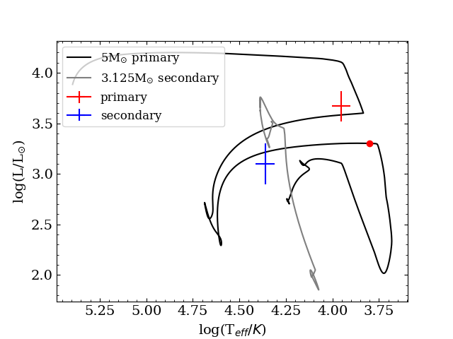
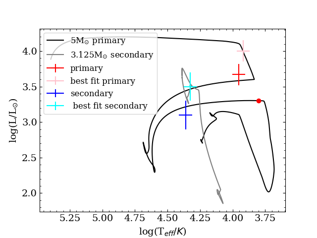

# X-ray binaries - exploring Cyg X-1

Cygnus X-1 is a well-known high-mass X-ray binary located at a distance of about 2.2 kpc, consisting of a black hole and an O-type supergiant companion. It was the first strong black hole candidate ever identified and remains one of the most extensively studied X-ray sources, exhibiting persistent emission powered by accretion from the stellar wind of the massive donor star. 
Recent observations by [Ramachandran et al., (2025)](https://arxiv.org/pdf/2504.05885) have updated its parameters:
<!-- - Donor mass: $29^{+6}_{-3} \rm\ M_\odot$
- Black hole mass: $17.5^{+2}_{-1} \rm\ M_\odot$
- Orbital period: $5.559$ d -->

#### Orbital parameters

- $M_\mathrm{donor} = 29 ^{+6} _{-3}\ \mathrm{M_\odot}$
- $M_\mathrm{BH} = 17.5 ^{+2} _{-1}\ \mathrm{M_\odot}$
- $P_\mathrm{orb} = 5.559\ \mathrm{d}$
- $\log \dot{M} = -6.5 \pm 0.2\ \mathrm{M_\odot\, yr^{-1}}$

#### Physical parameters of the donor

- $T_\mathrm{eff} = 28\,500 \pm 1000\ \mathrm{K}$
- $\log L/\mathrm{L_\odot} = 5.5 \pm 0.1$
- $\log g = 3.2 \pm 0.1$
- $R = 22.3 ^{+1.5} _{-2.5}\ \mathrm{R_\odot}$


The following exercises will focus on reconstructing the evolutionary history of Cygnus X-1. The goal is to identify a binary model that reproduces the observed parameters of the system.


**Fig. 1**: The HR diagram illustrating the potential evolution of the Cyg X-1 donor star as a product of a $17.4\,\rm M_{\odot}$ black hole (point mass) and a $34\,\rm M_{\odot}$ O-type star on the $5.5$ days orbit overlaid on the observed position of the Cyg X-1 primary. The plot displays three models with different mass-loss scaling factors of $1, 0.5$, and $0.2$ to demonstrate the effect of wind mass loss on evolution (taken from [Ramachandran et al., (2025)](https://arxiv.org/pdf/2504.05885))

## Task 1. Simulating the Evolution of Cygnus X-1

To simulate the evolution of Cygnus X-1, we would ideally start off with creating a fresh copy of the `work/` directory (`cp -r $MESA_DIR/binary/work .`) and modify the `inlist` files to capture all relevant physical efects leading the initial system to the current form. However, to save time we will use an already prepared *MESA work directory* that can be downloaded from here: **[⬇ Download](/mesa-school-labs-2025/wednesday/lab2_working_copy.zip)**

Following [Ramachandran et al., (2025)](https://arxiv.org/pdf/2504.05885), lets start off with setting the initial masses of the components, $M_\mathrm{1}~=~34 \rm\ M_\odot,\ M_\mathrm{2}~=~17.4 \rm\ M_\odot$ and orbital period $P~=~5.5 \rm\ d$ in the `inlist_project` file, designed to contain all information about the system-related quantities. To find the controls used by MESA, look into the MESA docs, under the [specifications for starting model](https://docs.mesastar.org/en/latest/reference/binary_controls.html#specifications-for-starting-model) section.


Note, that the component assigned with index **1** is considered as donor throughout the whole MESA run. Thus, the natural thing is to assign the bigger mass to `m1`.




In `binary_controls` section add the following lines

```fortran
   m1 = 34.0d0  ! donor mass in Msun
   m2 = 17.4d0  ! companion mass in Msun
   initial_period_in_days = 5.5d0  ! initial orbital period
```



As the secondary component is a black hole, we assume it to be a point mass and focus only on the detailed evolution of the donor. This can be done by setting `evolve_both_stars = .false.` in `binary_job` section. Additionally, we need to set a few additional controls to the system:

<!-- - -----------????? limit accretion using the Eddington limit, ?????----------- -->
- the `Kolb` mass transfer scheme,
- do the wind mass accretion from the donor to the BH. 


Look under the `do_wind_mass_transfer_1` control in MESA docs


- assume conservation of the total angular momentum of the system, include loss of angular momentum via mass loss and via gravitational wave radiation. 


Explore the `do_jdot_*` controls in the MESA docs to find the relevant controls.




```fortran
   do_jdot_ml = .true.  ! mass loss 
   do_jdot_gr = .true.  ! gravitational wave radiation
   do_jdot_ls = .true.  ! assume LS coupling due to tides
```



- enable rotation by assuming tidal synchronisation


Typically, rotation of the components is not the system-related quantity, and in MESA we enable rotation per-component, in the `inlist1/inlist2` files, under `star_job` using

```fortran
      ! rotation
      new_rotation_flag = .true.
      change_rotation_flag = .true.
      change_initial_rotation_flag = .true.
```

But we have that in our inlist already! What we want is to assume tidal synchronisation between stellar rotation period and the system orbital period. We do this in `inlist_project` file by allowing the `do_tidal_sync`.



To see if all runs well, compile (`./clean && ./mk`) and run your new model! (`./rn`). This is only to check if we set all the controls correctly, so kill the run after a few timesteps using `Ctrl C`.

### Finding the model that fits the observations

Based on the parameters obtained by [Ramachandran et al., (2025)](https://arxiv.org/pdf/2504.05885) (see the introductory part of this lab), we can try and find the model that fits within the measured spectroscopic parameters, like $T_{\rm eff}$, $\log L$ and $\log g$, and terminate the computations after doing so.

To force MESA to stop after finding a fitting model to the observations we need to modify the `run_binary_extras.f90` file. You can find it in the `src/` in working directory. We have already prepared the file, so all you need to do is to capture the MESA quantities and to compare them with observed parameters. One of the way is to use the observed uncertainities and to comare them with the MESA parameters as: 

```fortran
    if ( abs(Teff_MESA - Teff_obs) < dTeff_obs) then
        ...
    end if
```

As we want to capture not only $T_{\rm eff}$ but also other spectroscopic quantities, we need to expand the above example a bit.

Go ahead and add a stopping criterion `extras_binary_finish_step = terminate` in the `extras_binary_finish_step` function once a model reached a desired surface properties. Focus only on the *TASK 1.1* part this time.



In the very beggining of the `run_binary_extras` file we have already initialised some variables to address the observed parameters of the system:

```fortran
    ! Global parameters of Cyg X-1 
    real(dp), parameter ::  Teff_obs = 28500.0d0,  logL_obs = 5.5d0,  logg_obs = 3.2d0
    real(dp), parameter :: dTeff_obs =  1000.0d0, dlogL_obs = 0.1d0, dlogg_obs = 0.1d0
```

You can use these when comparing with the MESA quantities.





You can use the quantities internally computed by MESA using the binary pointer `b%` and star pointers `s1%`/`s2%` to acccess the donor/accretor modules, respectively. Some examples of useful values are:

- `b% s1% Teff`: The stellar effective temperature of the primary.
- `b% s1% photosphere_L`: The stellar luminosity of the primary.
- `b% s1% photosphere_logg`: Logarithm of the stellar gravitational acceleration of the primary.





You can instruct MESA to stop computations by using `extras_binary_finish_step = terminate` at the right place. 





```fortran
    integer function extras_binary_finish_step(binary_id)
        ...

         ! TASK 1.1
         ! Spectroscopic observations:
         !     Teff  = 28500 +/- 1000 K
         !     log_L = 5.5 +/- 0.1 Lsun
         !     log_g = 3.2 +/- 0.1
         !
         ! Apply a terminating condition, after we find a model fitting within the observed parameters
         if ( abs(b% s1% Teff - Teff_obs) < dTeff_obs .and. &
              abs(log10(b% s1% photosphere_L) - logL_obs) < dlogL_obs .and. &
              abs(b% s1% photosphere_logg - logg_obs) < dlogg_obs) then

            write(*,*) "Found a model maching the observations. Terminating"
            extras_binary_finish_step = terminate
        
        end if

    end function extras_binary_finish_step
```




<!-- To store a model at the end of the run, add the save controls in the `&star_job` section in your inlist:

```fortran
    save_model_when_terminate = .true.
    save_model_filename = 'final_CygX1.mod'
```

We will need that model in the subsequent runs! -->



**Bonus task!:**  
The above example was coded to terminate after finding the model that fits within the observations. As you may suspect, this model is not necessarily the only one, nor the best one to fit the observations. If you finished your assignments early, try to find the best model by applying some kind of a statistics, like $\chi^2$. You will need to define the `chi2` function outside of the `run_binary_extras.f90` main body, and call it before and after MESA calculates another step. You can find the places in `run_binary_extras.f90` that need some extra attention marked with a `! part of the bonus excercise` note.  **Good luck!**

#### Hint

For simplicity, we can assume that the $\chi^2$ have only one minimum between the models. This is, of course, a very naive approach as the evolutionary calculations are an extremely degenerate problem!

To be able to compare the value of the $\chi^2$ between the models we need to store them across the calculations. The best (not the easiest, though) way would bo to construct a table and to store the values of $\chi^2$ in it. However, the assumption that $\chi^2$ has only one minimum allows us to store the $\chi^2$ from only the previous step and to compare it with the current-step value. If $\chi^2_{\rm old} > \chi^2_{\rm new}$ then we have yet to reach the minimum, and there is still place for improving the fit between the observation and the model. Once we find the first model with $\chi^2_{\rm old} < \chi^2_{\rm new}$ we are in the minimum! 

This approach requires us to compute two values of $\chi^2$ at every step: the value for the previous step and for the current one. Here, the structure of the `run_binary_extras.f90` comes extremely helpful, as it contains two functions, `extras_binary_start_step` and `extras_binary_finish_step`. The latter updates the parameters of the system evolution after the calculations are done, while the former allows us to access the parameters before them being updated, thus from the previous step. This is the place to call the `chi2` function for the first time!

#### The $\chi^2$ statiscics formula

The formula for the $\chi^2$ statiscics is as follows:
$$\chi^2 = \sum_{i=1}^n \left( \frac{O_i-E_i}{\sigma_i} \right)^2, $$
where $O_i$ is the observed value, $E_i$ is the theoretical value (in our case returned by MESA) and $\sigma_i$ is the observed error.





Here is the solution to the bonus task.

```fortran
    integer function extras_binary_start_step(binary_id,ierr)
        ...
        ! part of the bonus excercise
        !
        ! store all spectral parameters, like Teff, logL or logg 
        ! from the previous step
        Teff_old  = b% s1% Teff
        logg_old  = b% s1% photosphere_logg
        logL_old  = log10(b% s1% photosphere_L)

        ! Calculate the chi2 statistics on the previous model

        chi2_value_old = chi2(Teff_old, logL_old, logg_old, &
                            Teff_obs, logL_obs, logg_obs, &
                            dTeff_obs, dlogL_obs, dlogg_obs)

        write(*,*) 'Chi2 from the previous step:',chi2_value_old
    end function  extras_binary_start_step

    ...

    integer function extras_binary_finish_step(binary_id)
        ...
        ! part of the bonus excercise
        ! Calculate the chi2 statistics on the current model
        !
        chi2_value = chi2(b% s1% Teff, log10(b% s1% photosphere_L), b% s1% photosphere_logg, &
            Teff_obs, logL_obs, logg_obs, &
            dTeff_obs, dlogL_obs, dlogg_obs)

        write(*,*) 'Chi2 from the current step:', chi2_value
        

        ! TASK 1.1
        ! Spectroscopic observations:
        !     Teff  = 28500 +/- 1000 K
        !     log_L = 5.5 +/- 0.1 Lsun
        !     log_g = 3.2 +/- 0.1
        !
        ! Apply a terminating condition, after we find a model fitting within the observed parameters
        if ( abs(b% s1% Teff - Teff_obs) < dTeff_obs .and. &
            abs(log10(b% s1% photosphere_L) - logL_obs) < dlogL_obs .and. &
            abs(b% s1% photosphere_logg - logg_obs) < dlogg_obs .and. &
            chi2_value > chi2_value_old) then

            ...
            
            extras_binary_finish_step = terminate
        end if

    end function extras_binary_finish_step

    ...

    ! Part of the bonus excercise
    ! Create a function calculating chi2 to be called from any place in run_binary_extras 
    !
    real(dp) function chi2(Teff_mod, logL_mod, logg_mod, &
                            Teff_obs, logL_obs, logg_obs, &
                            Teff_err, logL_err, logg_err)
        real(dp), intent(in) :: Teff_mod, logL_mod, logg_mod
        real(dp), intent(in) :: Teff_obs, logL_obs, logg_obs
        real(dp), intent(in) :: Teff_err, logL_err, logg_err

        chi2 = 0.0d0
        chi2 = chi2 + ((Teff_mod - Teff_obs) / Teff_err)**2
        chi2 = chi2 + ((logL_mod - logL_obs) / logL_err)**2
        chi2 = chi2 + ((logg_mod - logg_obs) / logg_err)**2
    end function chi2

```



<br><br><br>


**Extra bonus task!:**
We have an extra bonus task for you that explores stopping criteria and fitting a model for yet another observed system! You can find it at the end of this lab. 

**Disclaimer:** Take a look at this excercise **only** once you have finished all the parts below!



<br><br><br>



Got stuct during the lab? Do not worry! You can always download solution from here **[⬇ Download](/mesa-school-labs-2025/wednesday/lab2_solutions.zip)** to catch up!




### Gravitational waves radiation and merge time

Once we are all set to run our model, we can add one extra tweak to our computations. As we already assumed and implemented the loss of angular momentum via gravitational waves radiation in our model (the `do_jdot_gr` control in the `inlist_project` file), we can compute the approximate time our binary will take to merge. 

For two point masses $m_1$ and $m_2$ on a circular orbit with separation $a$, the GW inspiral time (Peters 1964) is given by

$$t_{\mathrm{merge}} = \frac{5}{256} \cdot \frac{c^5 a^4}{G^3 m_1 m_2 (m_1 + m_2)}.$$

Alternatively, using orbital period $P$ instead of orbital separation:

<!-- $$t_{\mathrm{merge}} = \frac{5}{256} \cdot \frac{(G M_{\mathrm{chirp}})^{-5/3}}{c^5} \cdot \left( \frac{P}{2\pi} \right)^{8/3},$$ -->

$$t_{\mathrm{merge}} = \frac{5}{256} \cdot c^5(G M_{\mathrm{chirp}})^{-5/3} \left( \frac{P}{2\pi} \right)^{8/3},$$

where $M_{\mathrm{chirp}}$ is the chirp mass:

$$M_{\mathrm{chirp}} = \frac{(m_1 m_2)^{3/5}}{(m_1 + m_2)^{1/5}}$$

We need to do this once MESA has updated all the system parameters, thus in the `extras_binary_finish_step` fuction. We have two choices: we can force MESA to compute the merge time on a fly at every step, to be able to see how the merge time depends on the orbital period and the distribution of masses between the components, or we can implement this chunk of code inside the `if` statement of the previously implememnted stopping criterion. As we are primarily interested to know the merge time at the current phase of the evolution, we can chose the second option.



MESA computes all we need under the hood. All we need to do is to capture all required quantities from MESA and to compute $t_{\mathrm{merge}}$. 





You can capture the required masses and orbital period using pointers, with `b% m(1)`, `b% m(2)` and `b% period`. The constants, as the speed of light $c$, the gravitational constant $G$ or the approximate value of $pi$ can be accesed from the `const_def` module (inside `const/public/const_def.f90` file). 





The scaffolding of where the gravitational wave calculations should be done

```fortran
      ! returns either keep_going or terminate.
      ! note: cannot request retry; extras_check_model can do that.
      integer function extras_binary_finish_step(binary_id)
         type (binary_info), pointer :: b
         integer, intent(in) :: binary_id
         integer :: ierr

         ! Initialise new variables
         ! GRAVITATIONAL WAVES EMISSION PART 
         ! real(dp) :: mchirp, t_merge, t_merge_gyr

         call binary_ptr(binary_id, b, ierr)
         if (ierr /= 0) then ! failure in  binary_ptr
            return
         end if  
         extras_binary_finish_step = keep_going

      
         ! TASK 1.1
         ! Spectroscopic observations:
         !     Teff  = 28500 +/- 1000 K
         !     log_L = 5.5 +/- 0.1 Lsun
         !     log_g = 3.2 +/- 0.1
         !
         ! Apply a terminating condition, after we find a model fitting within the observed parameters
         ! if(...) then

            ! GRAVITATIONAL WAVES EMISSION PART 
            ! Now that we have found the quasi-best fitting model, let's compute merger time due to GW 
            ! emission, based on Peters 1964
            !     From MESA lib: b% m(1) and b% m(2) are in grams, b% period is in seconds,
            !     const_def gives Msun, clight and standard_cgrav in cgs

         ! end if

      end function extras_binary_finish_step
```


> **Remember** that MESA lib (i.e. the internal library of MESA that allows direct access to stellar and binary model data during runtime) gives b% m(1) and b% m(2) in grams and b% period in seconds. Constants, such as $G \equiv $ `standard_cgrav` are in cgs. If you want to use the MESA-computed constants, remember that the `const_def` module needs to be imported (it is by default) at the beginning of the `run_binary_extras.f90`.



```fortran

    ! Initialise new variables
    ! GRAVITATIONAL WAVES EMISSION PART 
    real(dp) :: mchirp, t_merge, t_merge_gyr

    ...

    ! Chirp mass
    mchirp = ((b% m(1) * b% m(2))**(3.0d0 / 5.0d0)) / ((b% m(1) + b% m(2))**(1.0d0 / 5.0d0))

    ! t_merge in seconds
    t_merge = (5.0d0 / 256.0d0) * (clight**5 / standard_cgrav**(5.0d0 / 3.0d0)) * &
                ((b% period / (2.0d0 * pi))**(8.0d0 / 3.0d0)) * mchirp**(-5.0d0 / 3.0d0)

    ! seconds to Gyr
    t_merge_gyr = t_merge / (3600.0d0 * 24.0d0 * 365.25d0 * 1.0d9)

    write(*,*) 'Merger time [Gyr]  = ', t_merge_gyr
```



To apply all the changes you have made in your `run_binary_extras.f90` you need to compile (`./clean && ./mk`) and run your model (`./rn`)!

<!-- 

```fortran
      integer function extras_binary_finish_step(binary_id)
         type (binary_info), pointer :: b
         integer, intent(in) :: binary_id
         integer :: ierr

         double precision :: mchirp, t_merge, t_merge_gyr

         call binary_ptr(binary_id, b, ierr)
         if (ierr /= 0) then ! failure in  binary_ptr
            return
         end if  
         extras_binary_finish_step = keep_going
         
         write(*,*) 'Teff = ', b% s1% Teff, 'logL = ', log10(b% s1% photosphere_L), 'logg = ', b% s1% photosphere_logg
         write(*,*) 'f_RL = ', b% r(1)/b% rl(1)


         chi2_value = chi2(b% s1% Teff, log10(b% s1% photosphere_L), b% s1% photosphere_logg, &
                         Teff_obs, logL_obs, logg_obs, &
                         dTeff_obs, dlogL_obs, dlogg_obs)
         
         write(*,*) 'Chi2 from the previous step:',chi2_value_old
         write(*,*) 'Chi2:', chi2_value
      
      
         ! Spectroscopic observations:
         !     Teff  = 28500 +/- 1000 K
         !     log_L = 5.5 +/- 0.1 Lsun
         !     log_g = 3.2 +/- 0.1
         if ( abs(b% s1% Teff - Teff_obs) < dTeff_obs .and. &
              abs(log10(b% s1% photosphere_L) - logL_obs) < dlogL_obs .and. &
              abs(b% s1% photosphere_logg - logg_obs) < dlogg_obs .and. &
              chi2_value > chi2_value_old) then


            ! Now that we have the quasi-best fitting model, let's compute merger time due to GW emission, based on Peters 1964
            !     From MESA lib: b% m(1) and b% m(2) are in grams, b% period is in seconds,
            !     const_def gives Msun, clight and standard_cgrav in cgs

            ! Chirp mass
            mchirp = ((b% m(1) * b% m(2))**(3.0d0 / 5.0d0)) / ((b% m(1) + b% m(2))**(1.0d0 / 5.0d0))

            ! t_merge in seconds
            t_merge = (5.0d0 / 256.0d0) * (clight**5 / standard_cgrav**(5.0d0 / 3.0d0)) * &
                      ((b% period / (2.0d0 * pi))**(8.0d0 / 3.0d0)) * mchirp**(-5.0d0 / 3.0d0)

            ! seconds to Gyr
            t_merge_gyr = t_merge / (3600.0d0 * 24.0d0 * 365.25d0 * 1.0d9)

            ! write(*,*) 'Chirp mass [g]     = ', mchirp
            write(*,*) 'Merger time [Gyr]  = ', t_merge_gyr

            write(*,*) "Found a model maching the observations. Terminating"
            extras_binary_finish_step = terminate

         end if

      end function extras_binary_finish_step
```

 -->

<!-- ### Solution `run_binary_extras.f90`

```fortran
      ! returns either keep_going or terminate.
      ! note: cannot request retry; extras_check_model can do that.
      integer function extras_binary_finish_step(binary_id)
         type (binary_info), pointer :: b
         integer, intent(in) :: binary_id
         integer :: ierr

         ! Spectroscopic observations:
         !     Teff  = 28500 +/- 1000 K
         !     log_L = 5.5 +/- 0.1 Lsun
         !     log_g = 3.2 +/- 0.1
         real(dp), parameter ::  Teff_obs = 28500.0d0,  logL_obs = 5.5d0,  logg_obs = 3.2d0
         real(dp), parameter :: dTeff_obs =  1000.0d0, dlogL_obs = 0.1d0, dlogg_obs = 0.1d0

         call binary_ptr(binary_id, b, ierr)
         if (ierr /= 0) then ! failure in  binary_ptr
            return
         end if  
         extras_binary_finish_step = keep_going
         
         ! optional value printing
         write(*,*) 'Teff = ', b% s1% Teff, 'logL = ', log10(b% s1% photosphere_L), 'logg = ', b% s1% photosphere_logg
         write(*,*) 'f_RL = ', b% r(1)/b% rl(1)

      
      
         ! Apply stopping condition
         if ( abs(b% s1% Teff - Teff_obs) < dTeff_obs .and. &
              abs(log10(b% s1% photosphere_L) - logL_obs) < dlogL_obs .and. &
              abs(b% s1% photosphere_logg - logg_obs) < dlogg_obs) then

            write(*,*) "Found a model maching the observations. Terminating"
            extras_binary_finish_step = terminate

         end if

      end function extras_binary_finish_step

``` -->


<br><br><br>



Got stuct during the lab? Do not worry! You can always download solution from here **[⬇ Download](/mesa-school-labs-2025/wednesday/lab2_solutions.zip)** to catch up!



## Task 2. The efficiency of mass transfer and it's impact on the evolution of Cyg X-1

Mass transfer in close binary systems is a highly complex, multidimensional process shaped by hydrodynamic interactions, angular momentum exchange, and geometry-dependent flow patterns. Rather than a smooth and complete handover of mass from one star to the other, the gas is channeled through the inner Lagrangian point, forming a stream that enters the Roche lobe of the companion. Depending on the relative size and position of the stars, this stream may directly impact the accretor or settle into an accretion disk before any material is finally incorporated. A significant portion of the transferred matter might never reach the companion at all, being expelled from the system via outflows, disk winds, or loss through the outer Lagrangian points.

Capturing the full physics of this process requires 3D hydrodynamical simulations, which remain computationally expensive and inaccessible for 1D routine stellar evolution modeling. In the context of 1D codes like MESA, we therefore adopt simplified prescriptions that approximate the outcome of these processes through parameterized treatments.

A central parameter in such models is the accretion efficiency, which describes the fraction of the donor’s mass loss that is successfully accreted by the companion. MESA implements this through a set of `&binary_controls` parameters:

<!-- ```fortran
    mass_transfer_alpha  = 0d0 ! fraction of mass lost from the vicinity of donor as fast wind 
                               ! (e.g., isotropic re-emission)
    mass_transfer_beta   = 0d0 ! fraction of mass lost from the vicinity of accretor as fast wind
    mass_transfer_delta  = 0d0 ! fraction of mass lost from circumbinary coplanar toroid
    mass_transfer_gamma  = 0d0 ! radius of the circumbinary coplanar toroid is 
                               ! "gamma**2 * orbital_separation"
``` -->

- `mass_transfer_alpha` - fraction of mass lost from the vicinity of donor as fast wind 
                            ! (e.g., isotropic re-emission)
- `mass_transfer_beta` - fraction of mass lost from the vicinity of accretor as fast wind
- `mass_transfer_delta` - fraction of mass lost from circumbinary coplanar toroid
- `mass_transfer_gamma` - radius of the circumbinary coplanar toroid is 
                            ! "gamma**2 * orbital_separation"

The effective accretion efficiency is given by:

$$
\eta = (1 - \alpha - \beta - \delta)
$$

In this minilab, we will investigate how the choice of these parameters — particularly beta, which reflects wind loss near the black hole — influences the binary’s orbital and stellar evolution. We will adopt the default values of `mass_transfer_alpha = 0d0`, `mass_transfer_delta = 0d0` and `mass_transfer_gamma = 0d0` throughout, and explore a range of values for `mass_transfer_beta` to assess the impact of inefficient accretion in systems like Cygnus X-1. This will allow us to test how different mass loss scenarios shape the long-term configuration of the system.

### Varying the Mass Transfer Efficiency

To explore the effect of mass trasnfer efficiency on future evolution of Cyg X-1, we will vary the efficiency of mass transfer by changing the `mass_transfer_beta` parameter while keeping the initial primary masses and orbital period fixed, as were before. As each run may take a while, we will crowd-source this!

The participants should split into gropus that will be assigned different values of `mass_transfer_beta` and `limit_retention_by_mdot_edd`, which is a control for the Eddington limited mass-accretion rate. To do so, please write your name in the following [**Google Spreadsheet**](https://docs.google.com/spreadsheets/d/1HLwsGPu6w3t2NMUcdVYvkHFvqgIOUDkigfrZruN6Uo8/edit?gid=1375531873#gid=1375531873) (navigate to *Lab2 Mass Transfer Efficiency* tab in the lower-left corner if needed) to select a $\beta$ value, from **0.0, 0.1, 0.2, 0.3, 0.4, 0.5, 0.6, 0.7, 0.8, 0.9**, corresponding to accretion efficiencies from 100% up to 10%, respectively. These values come either without Eddington limit (by default) or with Eddington limited mass-accretion rate. If you choose the latter, remember to include `limit_retention_by_mdot_edd = .true.` in your `binary_controls` section!

> **Note:**  
>Do not change the initial masses or period. Focus only on the effect of beta. If you have a slower machine (with lower number of cores), choose lower $\beta$ as these runs tend to be faster. Faster machines can attempt higher beta values, which lead to more computationally demanding models. The $\beta=0.0$ run should take approximately 5 minutes on 2-core machines, while the $\beta~=~0.9$ run needs around 10 minutes.

As the model fitting within Cyg X-1 determined parameters is right on the onset of mass transfer, let us comment out the previously applied stopping criterion from the `run_binary_extras.f90` to let the system evolve a bit further. This time, let us choose the stopping criterion based on the minimum mass of the donor set to $23\,\mathrm{M_\odot}$. As MESA already has a command telling it to finish a run after such a condition is met, we do not need it to be implemented inside the `run_binary_extras.f90`. Instead, as the limit of mass applies only to one of the components, we need to include this condition in the `inlist1` file. Explore [stopping conditions](https://docs.mesastar.org/en/latest/reference/controls.html#when-to-stop) in the MESA docs to find the right command.


  
```fortran
      ! stop when mass drops below this limit
      star_mass_min_limit = 23.0d0
```



To make the runs a bit faster, reduce the resolution to

```fortran
      ! resolution
      mesh_delta_coeff = 2.0d0
      time_delta_coeff = 2.0d0
```

As the last thing we would like to do is to compare the merge time with the one we got in the previous step. Modify slightly the `run_binary_extras` file, as we no longer need to calculate the merge time only fot the specific model - let it be calculated for every model to see whether this value changes. Add the resulting merge time of the last computed model, when the donor reaches the minimum mass which terminates the run, to the [**Google Spreadsheet**](https://docs.google.com/spreadsheets/d/1HLwsGPu6w3t2NMUcdVYvkHFvqgIOUDkigfrZruN6Uo8/edit?gid=1375531873#gid=1375531873) in the column next to your name under the selected case.

Next, compile (`./clean && ./mk`) and run the models (`./rn`) with a fixed set of initial parameters (donor and black hole masses, and orbital period), while exploring different values of mass_transfer_beta. This isolates the role of accretion efficiency in shaping the orbital evolution, mass growth, and observable properties of the system.

> **As a group effort:**  
>What can we say about the future evolution of Cyg X-1 system from shuffling the `mass_transfer_beta` alone? How does the orbit react and why? 
>
>Should the merge time differ from the previous step, try to anwer why is that so? 

> **To think about:**  
> Is `mass_transfer_beta` the only way to control the accretor mass outcome? Can we substitute this parameter with other quantity that MESA provides, e.g. lowering the initial mass of the donor component? Why?


<br><br><br>



Got stuct during the lab? Do not worry! You can always download solution from here **[⬇ Download](/mesa-school-labs-2025/wednesday/lab2_solutions.zip)** to catch up!






Upsilon Sagittarii is a hydrogren deficient binary that has been suggested to be in its second stage of mass transfer, after the primary has expanded to become a helium supergiant following core helium exhaustion. [Gilkis & Shenar 2022](https://ui.adsabs.harvard.edu/abs/2023MNRAS.518.3541G/abstract) have identified the progentitor of this system to be a $5 M_{\odot}$ star with a $3.125 M_{\odot}$ companion and an initial orbital period of 8.4 days.

Like in Task 1.1. you will modify `src/run_binary_extras.f90` to capture the simulation at the values as determined from the observations of the binary system. Because the track is rather complicated, as can be seen in the figure below, we will slowly build up to finding the right combination of stopping criteria to match the models with the system. Remember to recompile the code every time you change something in the `src/run_binary_extras.f90` with (`./clean && ./mk`) and run your new model! (`./rn`).



*The HRD of the best fitting model from the paper along with the data points from the observations.*

The stellar parameters can be found in this table, which has been adapted from Table 1 of [Gilkis & Shenar 2022](https://ui.adsabs.harvard.edu/abs/2023MNRAS.518.3541G/abstract).
| Parameter       | Value       |
| -----------     | ----------- |
| $T_{eff,1}[kK]$      | $10\pm1$       |
| $T_{eff,2}[kK]$      | $23\pm2$        |
| $logL_{1}[L_{\odot}]$    | $3.67\pm0.15$       |
| $logL_{2}[L_{\odot}]$    | $3.1\pm0.2$        |

### Extra Bonus Task 1
In this task, you will try to capture the point where the simulation agrees with the observational data with only one stopping criterion, the effective temperature. Because the Roche-lobe overflow phase is computationally heavy for this particular system, the run will start shortly after, at the red dot in the HRD presented above. The saved model files are in 'Load', and you will need to adjust the path to the files in `inlist1` and `inlist2`. Besides this change, you won't have to change anything else in the various inlist-files, we will work with the `run_binary_extras.f90` exclusively. To make sure the models do not run too long, there is a maximum amount of models implemented in the `inlist_star`. To see if all runs well, compile (`./clean && ./mk`) and run your new model! (`./rn`). This is only to check if we set all the controls correctly, so kill the run after a few timesteps using `Ctrl C`.

To find the stopping point, use the following parameter in the `extras_binary_finish_step` hook in `run_binary_extras.f90`: 

`b% s1% teff` ! Effective temperature of the primary star of the binary system in Kelvin

Then, to compare with the observational data, add a write statement to your stopping criterion to print the effective temperature and the luminosity of the stopping point.

[Here are all the files](https://github.com/HEBrinkman/mesa-school-labs/tree/lab3/content/wednesday/BinaryEvolution_Lab3)



It is important to check the units of the parameters in MESA as compared to the units given in the literature. The effective temperature is given in kK in the table, while MESA uses Kelvin in the output.





  `write(*,*) "(your text)", (values) `
  
 is used to print text to the terminal by calling the appropriate values.





  There are multiple possible solutions. This is one example so you can continue to the next task.  
  
  ```fortran
         if ((b% s1% teff) .gt. 9000) then
               extras_binary_finish_step = terminate
               write(*,*) "terminating at requested effective temperature and luminosity:", b% s1% teff, log10(b% s1% l_surf)
               return
         end if
```


### Extra Bonus Task 2
In Extra Bonus Task 1 we have determined that working with just the effective temperature will not lead to a match between the simulation and the observations, as the luminosity is too low compared to the observations. In this next task, we will combine the luminosity and the effective temperature of the primary star to match the observations.
Use the following additional parameter in the `extras_binary_finish_step` hook in `run_binary_extras.f90`: 

`b% s1% l_surf` ! The luminosity of the primary star of the binary system in solar luminosities



As can be seen in the figure above, the stellar evolution track does not go through center of the data points. You will need to experiment with the error-margins to match the stellar track with the observations.





  There are multiple possible solutions, depending on how you combine the two parameters. This is one example so you can continue to the next task.
  ```fortran
         if (((b% s1% teff) .lt. 9000) .and. (log10(b% s1% l_surf) .gt. 3.57))   then
               extras_binary_finish_step = terminate
               write(*,*) "terminating at requested effective temperature and luminosity:", b% s1% teff, log10(b% s1% l_surf)
               return
         end if  
```


### Extra Bonus Task 3
Because we are working with a binary system, it is not only important to match the primary star, but also the secondary. However, matching two stars simultaneously is not a trivial task, and rather than fitting by eye like we are doing here, it is done with statistical methods. The best fit model presented in [Gilkis & Tomer 2022](https://ui.adsabs.harvard.edu/abs/2023MNRAS.518.3541G/abstract) thus does not match the exact observational values. So, instead of working with the observational values for the secondary, the model values will be used with the error-bars as presented in the literature, which is represented by the cyan cross in the HRD. The new values for the effective temperature and the luminosity are in the table below and were taken from Table 3 of the previously mentioned paper.



*The HRD of the best fitting model from the paper along with the data points from the observations and the location of the best fits.*

| Parameter       | Value       |
| -----------     | ----------- |
| $T_{eff,1}[kK]$      | $10\pm1$       |
| $T_{eff,2}[kK]$      | $21.2\pm2$        |
| $logL_{1}[L_{\odot}]$    | $3.67\pm0.15$       |
| $logL_{2}[L_{\odot}]$    | $3.5\pm0.2$        |

In the previous task, you have matched the simulations and the observations for the primary star. In this task, you will add a stopping criterion for the secondary star and try to match both stars with the models. Before you start your new run, enable the evolution of the secondary by setting the `evolve_both_stars` in `inlist_project` command to `.true.`
Use the following additional parameter in the `extras_binary_finish_step` hook in `run_binary_extras.f90`:

`b% s2% teff` ! Effective temperature of the primary star of the binary system in Kelvin

`b% s2% l_surf` ! The luminosity of the primary star of the binary system in solar luminosities

As in the previous tasks, write out the final luminosity and surface temperature of the simulation to the terminal.



  
  ```fortran
       if (((b% s1% teff) .lt. 9000) .and. (log10(b% s1% l_surf) .gt. 3.57) .and. ((b% s2% teff) .lt. 21200))   then
             extras_binary_finish_step = terminate
             write(*,*) "terminating at requested effective temperature and luminosity:", b% s1% teff, log10(b% s1% l_surf)
             write(*,*) "terminating at requested effective temperature and luminosity:", b% s2% teff, log10(b% s2% l_surf)
             return
       end if  
```



### Extra Bonus Task 4
If you have managed to get the double stopping criterion to work, you can experiment with other observables as can be found in Table 1 and 3 of the paper, and see which combinations work. For this you can use the following commands:

`b% s1% surface_()` ! The surface abundance of the following isotopes: h1, he4, c12, n14, o16.

`b% s1% photosphere_r` ! The radius of the star in solar radii

`b% s1% photosphere_logg` !The surface gravity 

As in the previous parts, there are multiple combinations possible to reach the observed values for the stellar parameters or the modelled parameters. Not all combinations might work.


<br><br><br>
### Acknowledgement
The MESA input files were built upon the following resource:  
[Gilkis & Shenar 2022](https://ui.adsabs.harvard.edu/abs/2023MNRAS.518.3541G/abstract)


