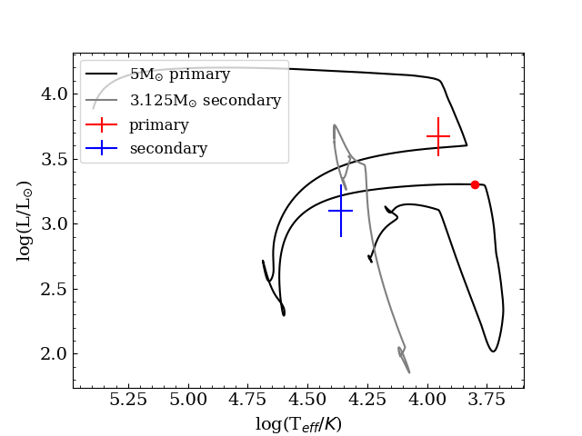

## Wednesday Mini-lab 3: Upsilon Sagittarii 
Upsilon Sagittarii is a hydrogren deficient binary that has been suggested to be in its second stage of mass transfer, after the primary has expanded to become a helium supergiant following core helium exhaustion. [Gilkis & Tomer 2022](https://ui.adsabs.harvard.edu/abs/2023MNRAS.518.3541G/abstract) have identified the progentitor of this system to be a $5 M_{\odot}$ star with a $3.125 M_{\odot}$ companion and an initial orbital period of 8.4 days.

You will modify `src/run_binary_extras.f90` to capture the simulation at the values as determined from the observations of the binary system. Because the track is rather complicated, as can be seen in the figure below, we will slowly build up to finding the right combination of stopping criteria to match the models with the system.



*The HRD of the best fitting model from the paper along with the data points from the observations.*

The stellar parameters can be found in this table, which has been adapted from Table 1 of [Gilkis & Tomer 2022](https://ui.adsabs.harvard.edu/abs/2023MNRAS.518.3541G/abstract).
| Parameter       | Value       |
| -----------     | ----------- |
| $T_{eff,1}[kK]$      | $10\pm1$       |
| $T_{eff,2}[kK]$      | $23\pm2$        |
| $logL_{1}[L_{\odot}]$    | $3.67\pm0.15$       |
| $logL_{2}[L_{\odot}]$    | $3.1\pm0.2$        |

## Task 1
In this task, you will try to capture the point where the simulation agrees with the observational data with only one stopping criterion, the effective temperature. Because the Roche-lobe overflow phase is computationally heavy for this particular system, the run will start shortly after, at the red dot in the HRD presented above. The saved model files are in 'Load', and you will need to adjust the path to the files in `inlist1` and `inlist2`. Besides this change, you won't have to change anything else in the various inlist-files, we will work with the `run_binary_extras.f90` exclusively.

To find the stopping point, use the following parameter in the `extras_binary_finish_step` hook in `run_binary_extras.f90`: 

`b% s1% teff` ! Effective temperature of the primary star of the binary system in Kelvin

Then, to compare with the observational data, add a write statement to your stopping criterion to print the effective temperature and the luminosity of the stopping point.

<details>
  <summary>Hint 1</summary>

It is important to check the units of the parameters in MESA as compared to the units given in the literature. The effective temperature is given in kK in the table, while MESA uses Kelvin in the output.

</details>
<details>
  <summary>Hint 2</summary>
  
  `write(*,*) "(your text)", (values) `
  
 is used to print text to the terminal by calling the appropriate values.
</details>


<details>
  <summary>Solution 1</summary>
  
  There are multiple possible solutions. This is one example so you can continue to the next task.  
  
  ```fortran
         if ((b% s1% teff) .gt. 9000) then
               extras_binary_finish_step = terminate
               write(*,*) "terminating at requested effective temperature and luminosity:", b% s1% teff, log10(b% s1% l_surf)
               return
         end if
```
</details>

## Task 2
In Task 1 we have determined that working with just the effective temperature will not lead to a match between the simulation and the observations, as the luminosity is too low compared to the observations. In this next task, we will combine the luminosity and the effective temperature of the primary star to match the observations.
Use the following additional parameter in the `extras_binary_finish_step` hook in `run_binary_extras.f90`: 

`b% s1% l_surf` ! The luminosity of the primary star of the binary system in solar luminosities


<details>
  <summary>Hint 1</summary>

As can be seen in the figure, the stellar evolution track does not go through center of the data points. You will need to experiment with the error-margins to match the stellar track with the observations.

</details>

<details>
  <summary>Solution 1</summary>
  There are multiple possible solutions, depending on how you combine the two parameters. This is one example so you can continue to the next task.
  ```fortran
         if (((b% s1% teff) .lt. 9000) .and. (log10(b% s1% l_surf) .gt. 3.57))   then
               extras_binary_finish_step = terminate
               write(*,*) "terminating at requested effective temperature and luminosity:", b% s1% teff, log10(b% s1% l_surf)
               return
         end if  
```
</details>

## Task 3
Because we are working with a binary system, it is not only important to match the primary star, but also the secondary. However, matching two stars simultaneously is not a trivial task, and rather than fitting by eye like we are doing here, it is done with statistical methods. The best fit model presented in [Gilkis & Tomer 2022](https://ui.adsabs.harvard.edu/abs/2023MNRAS.518.3541G/abstract) thus does not match the exact observational values. So, instead of working with the observational values for the secondary, the model values will be used with the error-bars as presented in the literature, which is represented by the cyan cross in the HRD. The new values for the effective temperature and the luminosity are in the table below and were taken from Table 3 of the previously mentioned paper.


*The HRD of the best fitting model from the paper along with the data points from the observations and the location of the best fits.*

| Parameter       | Value       |
| -----------     | ----------- |
| $T_{eff,1}[kK]$      | $10\pm1$       |
| $T_{eff,2}[kK]$      | $21.2\pm2$        |
| $logL_{1}[L_{\odot}]$    | $3.67\pm0.15$       |
| $logL_{2}[L_{\odot}]$    | $3.5\pm0.2$        |

In the previous task, you have matched the simulations and the observations for the primary star. In this task, you will add a stopping criterion for the secondary star and try to match both stars with the models. Before you start your new run, enable the evolution of the secondary by setting the `evolve_both_stars` in `inlist_project` command to `.true.`
Use the following additional parameter in the `extras_binary_finish_step` hook in `run_binary_extras.f90`:

`b% s2% teff` ! Effective temperature of the primary star of the binary system in Kelvin

`b% s2% l_surf` ! The luminosity of the primary star of the binary system in solar luminosities

As in the previous tasks, write out the final luminosity and surface temperature of the simulation to the terminal.

<details>
  <summary>Solution 1</summary>
  
  ```fortran
       if (((b% s1% teff) .lt. 9000) .and. (log10(b% s1% l_surf) .gt. 3.57) .and. ((b% s2% teff) .lt. 21200))   then
             extras_binary_finish_step = terminate
             write(*,*) "terminating at requested effective temperature and luminosity:", b% s1% teff, log10(b% s1% l_surf)
             write(*,*) "terminating at requested effective temperature and luminosity:", b% s2% teff, log10(b% s2% l_surf)
             return
       end if  
```
</details>


***
**Bonus exercise:**  
If you have managed to get the double stopping criterion to work, you can experiment with other observables as can be found in Table 1 and 3 of the paper, and see which combinations work. For this you can use the following commands:

`b% s1% surface_()` ! The surface abundance of the following isotopes: h1, he4, c12, n14, o16.

`b% s1% photosphere_r` ! The radius of the star in solar radii

`b% s1% photosphere_logg` !The surface gravity 

As in the previous parts, there are multiple combinations possible to reach the observed values for the stellar parameters or the modelled parameters. Not all combinations might work.

***
<br><br><br>
### Acknowledgement
The MESA input files were built upon the following resource:  
[Gilkis & Tomer 2022](https://ui.adsabs.harvard.edu/abs/2023MNRAS.518.3541G/abstract)
